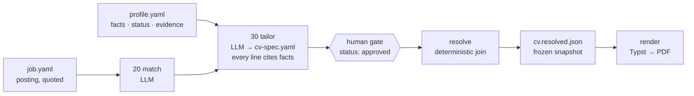

# cv-as-code

[](https://github.com/EmanuelePartenza/cv-as-code/actions/workflows/ci.yml)

**Fact-grounded CV generation with a governance gate.** Verified career facts
go in; an LLM drafts a CV whose every line cites the facts it rests on; a
person approves; deterministic code renders the PDF. What the machine can
check, it enforces; what only a person can judge, it hands to the person and
never pretends otherwise.

It is a *tool*, not a CV: your data lives in a directory of your own that the
framework never contains, in whatever language you write in.

## Sixty seconds of architecture



- **Lineage end to end.** A fact has an id, a status (`draft | verified |
  rejected`) and an evidence pointer to the document it came from. A CV bullet
  cites fact ids. The resolved JSON is the frozen join of profile and spec that
  a PDF was rendered from. Nothing on the page is untraceable.
- **Deterministic tail, non-deterministic head.** Drafting is an LLM stage,
  swappable, upstream of approval. From the approved spec to the PDF everything
  is plain Python and Typst: same JSON, same template, same bytes — CI proves
  it across Python versions on every push.
- **Gates that fail.** `cvac validate` refuses a spec that cites a fact that
  does not exist, or an `approved` spec that cites a fact that is not
  `verified`; `cvac cv --mode final` refuses a spec that is not approved. No
  code path sets `approved` or `verified`: those are a person's acts.
- **Contracts at every boundary.** Every document has a `kind` and a JSON
  Schema; every LLM stage is a file contract (`INSTRUCTIONS.md` + `io.yaml`)
  that any engine can execute; a data root is a directory with a marker file.
- **Declared limits**, below, not hidden.

## Try it in five minutes

```bash
uv tool install git+https://github.com/EmanuelePartenza/cv-as-code    # or: pipx install git+…
git clone https://github.com/EmanuelePartenza/cv-as-code && cd cv-as-code/example
cvac validate --all                                                     # 0 errors, 0 warnings
cvac cv users/robin/masters/port-operations-en --mode final
#   → users/robin/masters/port-operations-en/Robin_Ashcombe_Port_Operations_EN.pdf, one page
```

No external binary: the Typst compiler comes from PyPI and the fonts are
vendored. `example/` is a complete data root — Robin Ashcombe, a fictional
lighthouse keeper applying for a port job — produced through the framework's
own stages; [example/README.md](example/README.md) says what each file shows,
and has two commands that make the gates fail on purpose.

## Your own data

```bash
cvac init ~/my-cv --user <slug>       # a data root: cvac.yaml, users/<slug>/, jobs/
cd ~/my-cv
```

Data enters through a questionnaire in your language, not through a chat:
stage `05_interview` writes it, you fill it at your own pace, stage
`03_extract` turns it (or an old CV, a review, any document) into an evidence
note with proposed facts, each carrying the verbatim passage it rests on. Facts
enter your profile as `draft`; you verify them one by one. Then a master CV,
then postings, matches, tailored CVs and letters. The `/onboard` skill is that
procedure written down.

## Three ways to run a stage

The intelligent steps are file contracts under `pipeline/`. The same two files
serve three engines:

| Engine | How |
|---|---|
| **Claude Code** | `cvac skills install` puts `/job-ingest`, `/cv-tailor`, `/cover-letter`, `/cv-master` into your data root; each sequences a stage and asks you for the gate |
| **Any chat** | `cvac stage pack 20_match --job <id> > bundle.md`; paste it, save the answer where it says, `cvac validate` — [docs/manual-path.md](docs/manual-path.md) |
| **An API runner** | roadmap: the pack is its input |

## The data contracts

| kind | file | what the validator enforces |
|---|---|---|
| `profile` | `users/<u>/profile.yaml` | ids unique, facts prefixed by their parent, evidence paths exist, skills cite facts |
| `search` | `users/<u>/search.yaml` | the user exists |
| `cv-spec` | masters and applications | every ref exists; `approved` ⇒ every cited fact `verified`; template and labels exist |
| `job` | `jobs/<id>/job.yaml` | id equals its directory; the verbatim `raw.txt` is present |
| `match` | `users/<u>/matches/<id>.yaml` | strengths cite existing facts; the job exists |
| `cover-letter` | frontmatter of `letter.md` | source facts exist; `approved` ⇒ verified |
| `evidence` | frontmatter of a note | proposed facts attach to existing or declared parents; the source exists |
| `questionnaire` | frontmatter of an interview | shape and status |
| `labels` | `i18n/labels.<lang>.yaml` | every rendered string present: a missing label fails, never renders blank |
| `data-root` | `cvac.yaml` | the marker of a data root |

Schemas are in [`src/cv_as_code/schemas/`](src/cv_as_code/schemas/); every
rule above has a test that watches it fail ([tests/README.md](tests/README.md)).

## Language

The framework's surface — code, messages, docs, stage instructions — is
English and fixed. Everything of yours is locale data: your facts and notes in
your pivot language, each CV in its own language, rendered labels and date
formats from one YAML file per language (`it`, `fr`, `en` shipped; add one to
your data root's `i18n/` for any other). The example renders a French CV from
an English profile. [ADR-0007](docs/adr/0007-language-layers.md).

## What it does not do

- It does not check that a rewording is *faithful* to its facts. That is the
  human gate, by design; the validator proves citations and statuses, not
  meaning.
- It does not scrape job platforms or automate a browser. Postings are pasted.
- It does not predict page overflow; the page budget is checked after
  rendering.
- It does not track applications yet, and it does not call any model itself.

## Status

`v0.1` — the CLI, six stage contracts, the skills, the example, the tests and
CI exist. Roadmap (designed, not built): an API runner, a gap-closing stage
that turns a match's gaps into an evidence plan, interview preparation as a
stage, a profile report and `cvac fact verify`, market conventions beyond
language, connectors for posting APIs, application tracking. See
[docs/ARCHITECTURE.md](docs/ARCHITECTURE.md) §10 and the
[ADRs](docs/adr/README.md).

Nothing personal is in this repository, by construction:
[CONTRIBUTING.md](CONTRIBUTING.md) explains the publication boundary.

## Licence

MIT. Fonts: Lato, SIL Open Font License 1.1
([src/cv_as_code/templates/fonts/OFL.txt](src/cv_as_code/templates/fonts/OFL.txt)).
